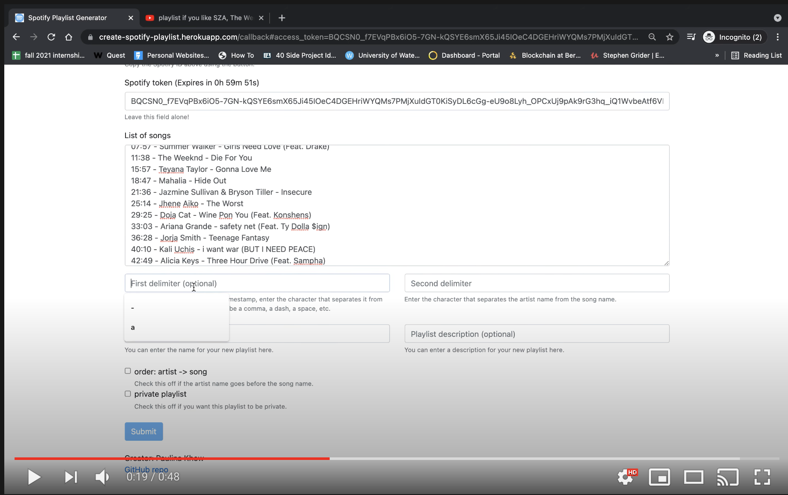

# playlist_generator
This is a application that generates a Spotify playlist from text, deployed on Heroku.

## How to Use
Walkthrough of the [playlist generator app](https://create-spotify-playlist.herokuapp.com/) can be found in the following [Youtube video](https://www.youtube.com/watch?v=nQRaDjje7S4&ab_channel=PaulinaKhew):
[](https://www.youtube.com/watch?v=nQRaDjje7S4&ab_channel=PaulinaKhew)

## Tools and APIs
- [Spotify web api](https://developer.spotify.com/documentation/web-api/)
- [Python requests library](https://requests.readthedocs.io/en/master/)

## Nice to know
- Learn about OAuth for free [here](https://www.oauth.com/oauth2-servers/background/). I've created a repo that implements a simple OAuth script using python and the GitHub API [here](https://github.com/Paulinakhew/oauth).

## Local Dev Setup
1. Install dependencies:
```
pip3 install -r requirements.txt
```

2. Create an `.env` file
- copy the `.env.template` file into an `.env` file using the following command:
```
cp .env.template .env
```

Your `.env` file should be formatted as follows:
```
CLIENT_ID=
CLIENT_SECRET=
REDIRECT_URI=http://127.0.0.1:5000/callback
SECRET_KEY= #Use output of python -c 'import os; print(os.urandom(16))'
```
- update the `SECRET_KEY` by pasting the output of
```
python -c 'import os; print(os.urandom(16))'
```

3. Collect your Spotify client ID and client secret from Spotify and add it to the `.env` file
- to get both the client ID and the client secret, you have to go to the [Spotify Developer Dashboard](https://developer.spotify.com/). Create an application and then copy the client ID and client secret into the respective environment variables

4. Run the `create_playlist.py` file
```
python3 flask_app.py
```

## How it works

The first page has a button that triggers the Spotify authentication flow.


If you're not logged in on the web browser, you'll be taken to the second page where you can log in through the method of your choice.


Once you've been logged in, you'll need to copy the two fields at the top and paste them into the first two textboxes. Once that has been complete, you can paste a list of songs into the large textbox and paste the delimiters.

## Example
### List of Songs
The `List of songs` field would be populated by a list of songs. The following example is taken from a comment on a YouTube video.
```
0:02 - Butterfly by UMI
2:43 - Chateau by Djo
7:16 - Six AM by Inner Wave
9:23 - In a Mood by TheSecondSex
13:31 - Lavender Kiss by The Licks
17:35 - Gimme Love by Joji
21:11 - Sink Into the Floor by Feng Suave
25:49 - Somebody Else by The 1975
31:39 - Only in my Dreams by The Marías
34:30 - Love it if We Made it by The 1975
38:43 - Freakin' Out On the Interstate by Briston Maroney
42:56 - Midnight Blue by Puma Blue
47:36 - Loverboy by The Marías
51:26 - Soft Porn by Puma Blue
```
As you can see, the YouTube timestamps have been included. To get rid of these, you would fill out the first delimiter field.

### First delimiter
This field is where you would place the symbol/text that separates the timestamps from the rest of the information. In this case, it is a dash.
```
-
```
The code will remove everything located up until the `-`, leaving the text on the right side.

### Second delimiter
This field is where you would place the symbol/text that separates the artist name from the song name.
```
by
```
The code will separate the artist and songs by the second delimiter (which is `by` in this case). It will use the Spotify API to search up each song by artist and song name and add it to a public playlist.

### Playlist name (optional)
If you want to create a custom playlist name, you would add that here. Otherwise, the default is `New Playlist`
```
Songs to listen to on a late night drive
```

### Playlist description (optional)
If you want to add a custom playlist description, you would add that here. Otherwise, the default is `New playlist for songs using https://create-spotify-playlist.herokuapp.com/`
```
Playlist generated from a YouTube video
```

### order: artist -> song
Check off this checkbox if the artist is placed before the song names. Otherwise, leave it blank.

### Success!!
If the playlist was successfully created, you will see a green alert box pop up with the response from Spotify. This will contain a `snapshot_id`. Your new playlist should appear immediately on Spotify.

